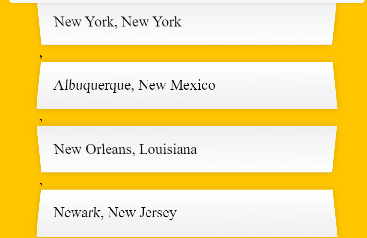

<h1>Async/await with fetch</h1>
https://dmitripavlutin.com/javascript-fetch-async-await/

`fetch()` returns the `Response` object. The Response object offers a lot of methods that resolve the response in different formats (and the methods all return promises so you need to `await` them as well).

<ul>
<li><code>response.json()</code> returns a promise resolved to a JSON object</li>
<li><code>response.text()</code> returns a promise resolved to raw text</li>
<li><code>response.formData()</code> returns a promise resolved to <a href="https://developer.mozilla.org/en-US/docs/Web/API/FormData">FormData</a></li>
<li><code>response.blob()</code> returns a promise resolved to a <a href="https://developer.mozilla.org/en-US/docs/Web/API/Blob">Blob</a> (a file-like object of raw data)</li>
<li><code>response.arrayBuffer()()</code> returns a promise resolved to an <a href="https://developer.mozilla.org/en-US/docs/Web/JavaScript/Reference/Global_Objects/ArrayBuffer">ArryBuffer</a> (raw generic binary data)</li>
</ul>

<h1>Helpful js functions to update DOM</h1>
<a href="https://www.w3schools.com/jsref/met_node_appendchild.asp">appendChild()</a>
 - must call getElementById first to know which node to append the child to.
<a href="https://developer.mozilla.org/en-US/docs/Web/API/Element/append">append()</a>
 - Inserts a <b>set</b> of Node objects or string objects after the last child of the Element
<a href=" https://developer.mozilla.org/en-US/docs/Web/API/Element/replaceChildren">replaceChildren()</a>
 - NEW IN 2022!! replaces the existing children of a Node with a specified new set of children. If you want to remove all children then call with no arguments `replaceChildren()`

 <h1>Matching strings</h1>
 You can user `string.includes()` or use <b>Regex</b>.
 In this case, we can use
    const regex = new RegExp(wordToMatch, 'gi');
    return place.city.match(regex) || place.state.match(regex);
Where you pass in the flags you want for the second argument.
 - g = global, it will search through the entire string for a match
 - i = case insensitive

<h1>Formatting multi-line html</h1>
Instead of creating multiple elements and appending them one by one, you can write all of your html at once with template literals:

    const html = filteredList.map((c) => {
      return `
        <li>
          ${formatCity(c)}
          ${formatPopulation(c.population)}
        </li>
      `;
    }).join('');

    sugggestions.innerHTML = html;

<b>Remember:</b> Map creates an ARRAY. So if your html looks like this:

to remove the commas, turn the whole array into a string with `.join()`
